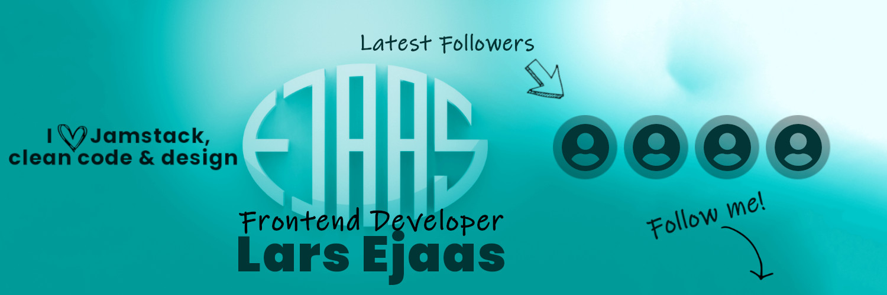

<div id="top"></div>

<!-- PROJECT LOGO -->
<br />
<div align="center">
  <a href="https://larsEjaas.com/en/">
    
  </a>

  <h3 align="center">Interactive Twitter banner</h3>

  <p align="center">
    An interactive Twitter banner build in Node.js and hosted on Netlify!
    <br />
    <a href="https://twitter.com/LarsEjaas"><strong>Live banner on my Twitter profile »</strong></a>
    <br />
    <br />
    <a href="https://twitter.com/intent/follow?original_referer=https%3A%2F%2Fpublish.twitter.com%2F&ref_src=twsrc%5Etfw%7Ctwcamp%5Ebuttonembed%7Ctwterm%5Efollow%7Ctwgr%5ELarsEjaas&screen_name=LarsEjaas" class="twitter-follow-button" data-show-count="false">Don't forget to give me a follow @Twitter</a>
  </p>
</div>

<!-- TABLE OF CONTENTS -->
<details>
  <summary>Table of Contents</summary>
  <ol>
    <li>
      <a href="#about-the-project">About The Project</a>
    </li>
    <li>
      <a href="#getting-started">Getting Started</a>
      <ul>
        <li><a href="#installation">Installation</a></li>
      </ul>
    </li>
    <li><a href="#license">License</a></li>
    <li><a href="#contact">Contact</a></li>
    <li><a href="#acknowledgments">Acknowledgments</a></li>
  </ol>
</details>

<!-- ABOUT THE PROJECT -->

## About The Project


<br />
<br />

The Twitter API enables programmers to access data from their Twitter profile directly. This includes data like Tweets, Direct Messages, Spaces, Lists, users, and more.

This project will leverage the API to interact with your list of followers to create an interactive banner that displays the 4 most recent followers on your Twitter profile.

The banner utilizes a serverless Node.js function that pulls the 4 most recent followers once every hour. Thereafter, the function will overlay the follower's profile picture to the banner image and upload the updated banner to your profile.

There are various places you can run a project like this, but I choose Netlify due to a generous free tier limit and because they allow you to run scheduled functions.

<p align="right">(<a href="#top">back to top</a>)</p>

<!-- GETTING STARTED -->

## Getting Started

### Installation

1. Get a free API Key for your Twitter profile at [https://developer.twitter.com/](https://developer.twitter.com/)

2. Apply for Elevated Access to the Twitter API. Don't worry: this is free.

3. Clone the repo
   ```sh
   git clone https://github.com/LarsEjaas/TwitterBanner.git
   ```
4. Install NPM packages
   ```sh
   npm install
   ```
5. Create an `.env` file and add the variables listed in `.env.example` replacing the values with the keys from the API.

<p align="right">(<a href="#top">back to top</a>)</p>

<!-- LOCAL DEVELOPMENT -->

## Local development

Netlify CLI is a command line interface that can be used to develop and debug Netlify functions locally. To use the client install it globally:

```sh
npm install netlify-cli -g
```

Read more details about the client at [netlify](https://docs.netlify.com/cli/get-started/)

You can start the client by running:

```sh
netlify dev
```

...and while the client dev environment is running from a separate terminal run the function:

```sh
netlify functions:invoke
```

to test the function locally.

<p align="right">(<a href="#top">back to top</a>)</p>

<!-- LICENSE -->

## License

This project comes with no license. Feel free to clone the project and modify it to your liking.

<p align="right">(<a href="#top">back to top</a>)</p>

<!-- CONTACT -->

## Contact

Lars Ejaas - [@twitter](https://twitter.com/larsEjaas) - [Write to me directly on my webpage](https://larsEjaas.com/en/)

<p align="right">(<a href="#top">back to top</a>)</p>

<!-- ACKNOWLEDGMENTS -->

## Acknowledgments

The code for this project was inspired by code from several sources. Mainly:

[Making dynamic Twitter header](https://ppolivka.com/posts/dynamic-twitter-header)

and

[How I made my Twitter header dynamic](https://daily-dev-tips.com/posts/how-i-made-my-twitter-header-dynamic/)

Please follow Pavel Polívka and Chris Bonkers on Twitter if you like their articles and content:

[Chris Bongers](https://twitter.com/DailyDevTips1)

[Pavel Polívka](https://twitter.com/pavel_polivka)

<p align="right">(<a href="#top">back to top</a>)</p>

<!-- LINKS FOR IMAGES -->

[product-screenshot]: 1500x500.jpg
